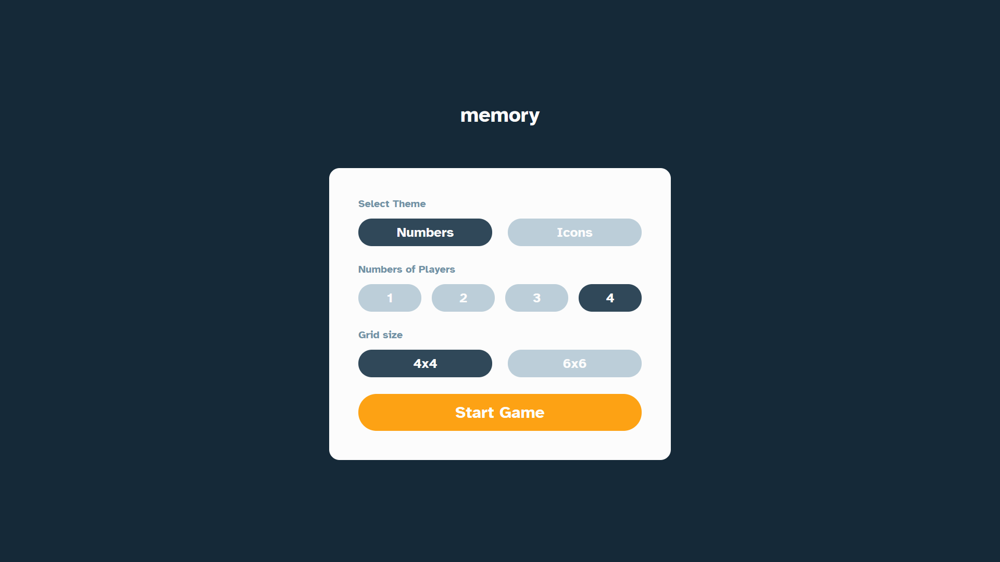
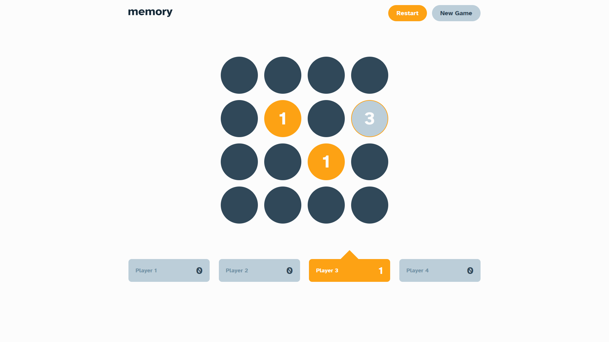
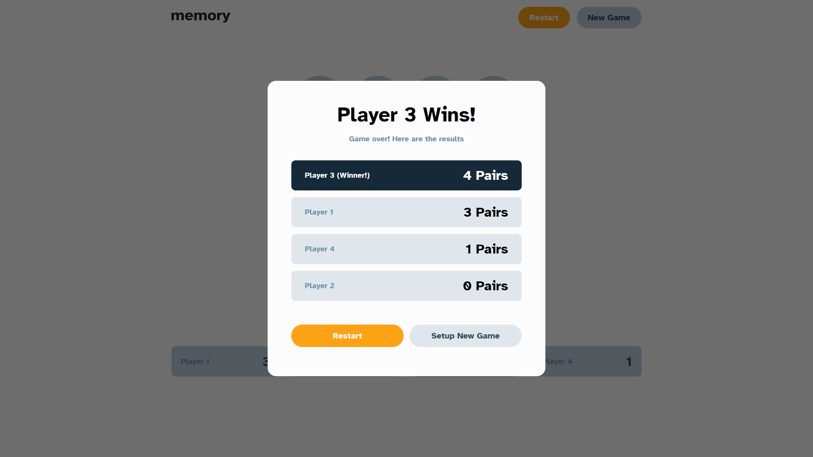
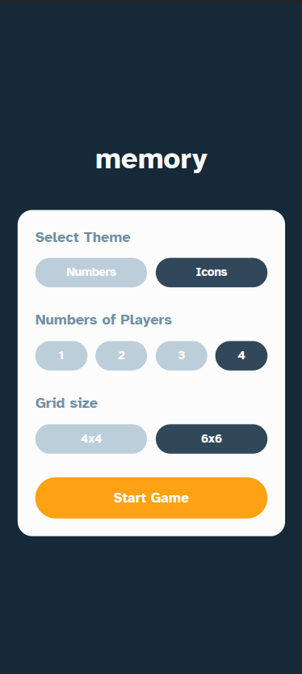
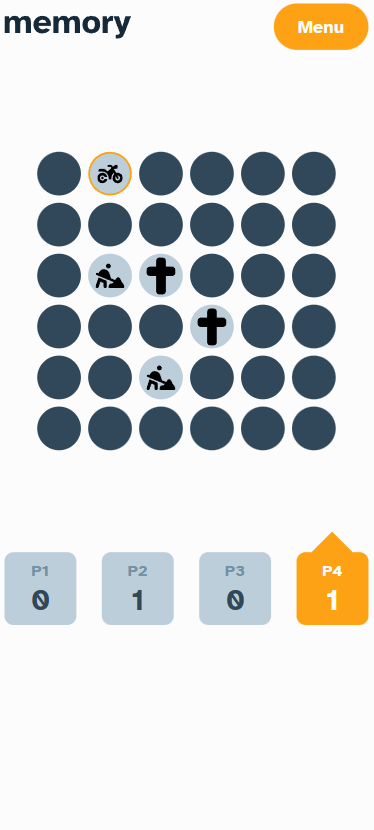
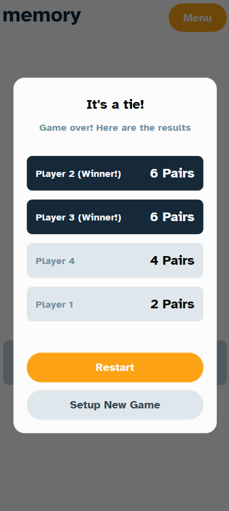

# Memory game

## The challenge

This project is my solution of a challenge. The challenge is to build a memory game from a figma file. It has 2 pages basicaly. One from home and other for the game. The style of the cards can be number or icons. The number of players can be from 1 up to 4.

### Home Page

At Home page, the user can:

* Choose the theme of the game. It can be either **numbers** or **icons**.
* Choose the amount of players. It can be **1**, **2**, **3** or **4**.
* Choose the grid size. It can be **4x4** or **6x6**. If it is **4x4**, will have 16 cards available to the game. 36 cards otherwise.

After picking up the options, the user can click on __Start__ button to start the game. On the game page, it will display the board and the points of each player. If it is a single player, will show a timer and number of moves.

The app has styles for all situations. If the choice is correct or wrong, cards will change color according to the situation. Also the selected one will be marked.

In the end, the result will be displayed. Can have a winner or a tie. The app can handle both situations.

__The application is **100% responsive**__

## Technologies used

* React
* TypeScript
* SCSS
* HTML

## ScreenShots

### Desktop

Home page                  |  Game Page                | Result Page
:-------------------------:|:-------------------------:|:-------------:
  |   | 

### Mobile

Home page                  |  Game Page                | Result Page
:-------------------------:|:-------------------------:|:-------------:
  |   | 

## Conclusion

This challenge was a real challenge. I used lots of hooks and concepts of react, like ContextAPI and immutability. 
The information about the players was used in multiple components. Because of this, I choose ContextAPI to avoid __prop drilling__.

For styles wasn't difficult. Sass helps us a lot during code. With Sass I could nest my styles, use variables and mixins.

This app will be running on Vercel. You can see it running by clicking on the link above near description.

Thank you.
Best regards.
Vinicius.
